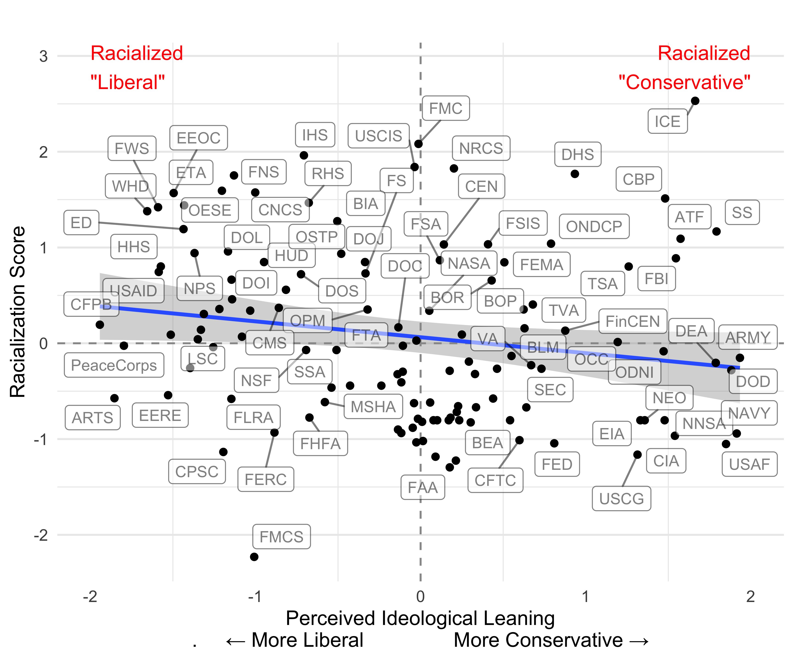
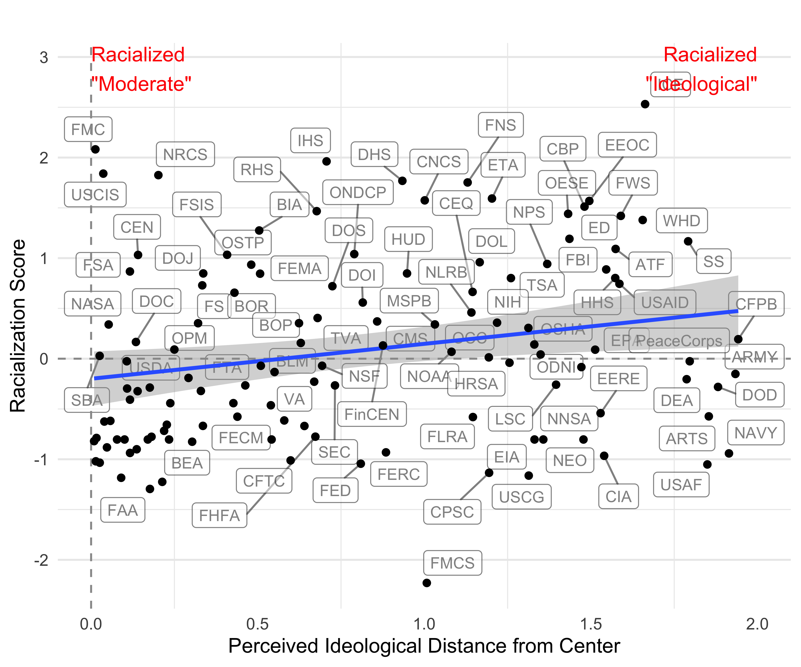

```{r knit-options}
library(scales) # for percents

# inline numbers round to 2, comma at thousands
knitr::knit_hooks$set(inline = function(x) {
  if (is.na(as.numeric(x))) {
    return (x)
    } else
        return (as.numeric(x) |> 
                 round(2) |>
                 format(big.mark=",") 
        )
})

# numbers cited in the paper that may change
load(here::here("data", "numbers-for-paper.Rdata"))
n_total <- sum(n_mfl_total, n_nyt_articles, n_rules)
n_racial <- sum(n_mfl_racial,n_rules_racial, n_nyt_racial)
```

\clearpage 

<!-- 
QUESTION FOR KARLA: 

Feedback on framing: the main thing is that we want to focus on how racialization differs from perceived ideology. Examples from news coverage and 2025, etc, where both liberal and conservative agencies are described with racialized terms, will help make the results clear.  -->


<!--EXAMPLES (if we need more)
https://www.nytimes.com/2026/03/07/arts/humanities-endowment-doge-trump.html?searchResultPosition=1


Environmental Justice is not yet included.
--> 

# Introduction {#sec-intro}

<!--WHY WE ARE WRITING THIS PAPER-->

Public policy is given effect through government institutions. As such, efforts to shape policy almost necessarily involve efforts to affect the actions of institutions, enhance or undermine their perceived legitimacy, and shape public perceptions of their role in political conflicts. Racial inequality and resentment are major drivers of policy initiatives and political behavior in many contexts, including the United States [@kinder_divided_1996]. Because of this, policymakers, politicians, and advocates strategically deploy racial cues to reinforce or challenge policy directions, framing institutions and their activities as aligned with---or in opposition to---specific racial and political ideologies. Likewise, policymakers and advocates may also strategically attempt to de-racialize institutions if not talking about race better advances their policy agenda.  These linguistic signals in elite discourse and media narratives frame the roles of various institutions in the political landscape of their time. Measuring racialization shows how public discourse around each federal agency pays more or less attention to race over time.

We define institutional racialization as the relative extent to which the public and elite language used to describe an institution and its actions highlight implications for racialized groups. Our definition builds on the work of sociologists and political theorists on racialized cues, racial formation, and systemic racism---especially the concepts of racialization and institutional racism. Institutional racialization captures both how social structures are organized along racial lines [@omi_racial_2014] and how public discourse frames institutions as having greater or lesser stakes for racial inequality.<!--CITE-->
One of the main ways that framing processes affect politics and policymaking is by affecting the perceived stakes of policy [@woodly_politics_2015]. 

Racialization and de-racialization may have different implications for institutional racism at different times. @bonilla-silva_racism_2022 emphasizes that racism is a system of practices that produces and sustains racial structures, impacting life chances by providing advantages to dominant racial groups and disadvantages to others. Talking about race may serve to reduce structural advantages by paying attention to them (e.g., civil rights enforcement, studies, or disproportionate impact across racial groups). Alternatively, highlighting race may increase structural advantage (e.g., authorizing racial profiling or framing social assistance policies as a handout to Black people was a way of mobilizing White racial resentment to undermine the policy).  

Our definition is an attempt to synthesize contributions in a way that allows systematic measurement of how organizations are organized along racial lines through public discourse.

<!-- @omi_racial_2014 "Racial projects are efforts to shape how human identities and social structures are racially signified, and the reciprocal ways that racial meaning becomes embedded in social structures. We see racial projects as building blocks in the racial formation process; these projects are taking place all the time, whenever race is being invoked or signified, wherever social structures are being organized along racial lines. Racial formation is thus a vast summation of signifying actions and social structures, past and present, that have combined and clashed in the creation of the enormous complex of relationships and identities that is labeled race."

@smith_civic_2008 states, "I show that through most of US history, lawmakers pervasively and
unapologetically structured US citizenship in terms of illiberal and undemocratic racial, ethnic, and gender hierarchies, for reasons rooted in basic, enduring imperatives of political life."

@ray_theory_2019's theory explains that "organizations are racial structures—cognitive schemas connecting organizational rules to social and material resources."

@bonilla-silva_racism_2022 explains, "This means that racism is about the practices and behaviors that produce a racial structure— a network of social relations at the social, political, economic, and ideological levels that shapes the life chances of the various races. This structure is responsible for the production and reproduction of systemic racial advantages for some (the dominant racial group) and disadvantages for others (the subordinated races). -->

<!--Institutions are under attack for working to address racial inequality.-->
Racialization plays a key role in efforts to reshape government institutions. For example, approximately half of the Biden Administration's executive orders instructed agencies to initiate civil rights-related actions, many explicitly demanding attention to race. Several "whole-of-government" initiatives included instructions to agencies that had not previously highlighted the racial implications of their policies and programs to hire staff to assess the impacts of the agency's actions on racial inequalities. This included a 2021 executive order titled Advancing Racial Equity and Support for Underserved Communities Through the Federal Government, which initiated efforts to increase racial equity across federal institutions. Other initiatives, such as restricting immigration by refusing to process asylum claims, were arguably driven by a resurgence of racial resentments generated by successful efforts to re-racialize immigration policy. Immigration policy began as explicit racial exclusion, then underwent reforms that de-emphasized racial implications, and is now increasingly racialized again. <!--https://civilrights.org/wp-content/uploads/2023/06/Civil-and-Human-Rights-Executive-Order-Progress-Report.pdf--> 

In January 2025, the Trump Administration issued the "Ending Radical and Wasteful Government DEI Programs and Preferencing" executive order, initiating efforts to dismantle diversity, equity, inclusion, and accessibility (DEIA) in federal programs and practices. This executive order instructs agency heads to end efforts to reduce patterns of racial exclusion in the federal workforce. In tandem with this order, numerous federal employees whose jobs included attention to racial diversity, equity, or inclusion were targeted and abruptly dismissed. In parallel, significant budget cuts targeted programs and institutions researching racial inequalities and patterns of exclusion. Funding for initiatives promoting racial equity has been severely restricted, limiting their ability to function and fulfill their missions. These initiatives were largely aligned with the language and goals of the Heritage Foundation’s Project 2025, which outlined policies designed to reduce attention to racial inequity in the work of federal government institutions.

In other ways, attention to race increased under the Trump administration. Departing from the longstanding practice of law enforcement denying accusations of racial profiling, the administration defended racial profiling as legal if related to immigrant capture and removal operations.<!--CITE--> At the same time, the US State Department and US Citizenship and Immigration Services (USCIS) justified prioritizing White South Africans because they allegedly face racial discrimination.<!--CITE--> Likewise, the Equal Employment Opportunity Commission (EEOC) invested resources in encouraging White Americans to bring claims of reverse discrimination.<!--CITE--> The EEOC also reclassified employer efforts to prevent discrimination and create inclusive workplaces as discrimination against White men.<!--CITE-->

<!--- TO ADVANCE THE ARGUMENT, THIS NEEDS TO TALK ABOUT RACIALIZATION OF THE DEPT OF EDUCATION, NOT THE RHETORIC OF STATES RIGHTS On March 20, 2025, the Trump administration issued another major executive order, "Improving Education Outcomes by Empowering Parents, States, and Communities." This order aims to dismantle the Department of Education, arguing that the federal education bureaucracy had failed and that authority over education should return to state control. 

This is a study of differences and changes in rhetoric that often reflect policy changes. However, the same policy can be discussed in more or less racialized terms. 

Racialization indicates attention to race. This may be due to efforts to maintain or establish racial hierarchies or efforts to undermine them.

EXAMPLES 

^ ask Devin about this ^
--->

The common theme in these examples is reforms and scrutiny targeting specific federal agencies by framing the institution within the context of racial politics or by de-emphasizing that frame. The language used by policymakers, politicians, advocates, and the media to describe agencies highlights how specific agencies are racialized or deracialized to advance various policy goals. This raises important descriptive questions: *(1) How consistent is racialization in different contexts (e.g., the media, advocacy, and policymaking)? (2) How consistent is racialization over time? (3) Do perceptions of racialization differ across agencies typically seen as either conservative or liberal?*

To help scholars address these questions, this paper develops measures of institutional racialization, capturing when race becomes a salient dimension of discourse surrounding federal agencies and their work. Using a large corpus of media coverage, policy documents, and advocacy agendas, the measure captures when agencies are discussed in racialized language. By identifying these moments, the paper provides a way to observe how bureaucratic institutions become embedded in broader political conversations over race.

We use data from advocacy groups, news media, and policy documents from agencies themselves. We identify `r n_racial` instances of agencies using or being discussed with racial language, including `r n_mfl_racial` paragraphs in the Heritage Foundation's Project 2025 Mandate for Leadership report, `r n_nyt_racial` articles in the New York Times, and `r n_rules_racial` agency rules. By scaling the relative frequency that each source does and does not use racialized language when talking about an agency or its policies, we show which agencies are relatively more racialized within and across realms of public discourse. 
Our new measures also offer a temporal lens through which to understand how both liberal and conservative institutions are perceived as racialized, particularly in the framing of agencies in terms that reflect racial tension, mitigation, or attention.  

For example, immigration policy can be discussed in ways that undermine racial hierarchy ("we are a nation of immigrants"), reinforce it ("immigration enforcement protects America for Heritage Americans") or in more neutral ways ("USCIS facilitates an orderly process of immigration and naturalization." ) Our hope is that our measure distinguishes the racialized (the first two) from the latter. By doing so, the paper adds a new dimension to the study of bureaucratic politics and provides a tool for examining how racial conflict shapes policy debates and executive governance.

Education policy has also seen differences in racialization. For a time, federal education policy did not interfere with school segregation. Then that changed, and federal education policy focused on racial desegregation and equal treatment. Backlash to diversity and equity-oriented education policy focused on preventing the consideration of race in admissions. While nominally promoting "race-neutral" policy, the government must speak about race to bar private entities, like universities, from considering race. From the government's perspective, the policy of preventing the consideration of race in university admissions is the government attending to race. If this gloss were reflected in the data, we should see the Department of Education becoming sharply more racialized with federally-forced desegregation, tapering off with decreased emphasis on segregation and more neutral emphasis on equal opportunity, and then an increase as fights over diversity, equity, and inclusion policies emerge.

<!--WHY MEASURING THIS IS IMPORTANT --> 
Measuring racial discourse surrounding federal agencies is important because visibility is a necessary precursor to accountability. Scholars and policymakers cannot evaluate whether government institutions reinforce or dismantle racial hierarchies if implications for racial equity remain difficult to observe. By identifying when race becomes visible, or when efforts are made to remove racial language from policy discussions, this measure provides a new empirical lens for studying how racial politics shape the administrative state.

We show that racialization is distinct from political ideology. Racialization is correlated with perceptions of ideological extremism---agencies perceived as further from the political center tend to also be more racialized --- but this relationship is only statistically significant (p < 0.05) in the Project 2025 Mandate for Leadership text.

<!--This paper makes contributions. 1) It introduces a new empirical measure of agency racialization that captures when race enters discussions of federal agencies. 2) It develops a framework for understanding the political and institutional conditions under which agencies become racialized actors. 3) It provides a foundation for studying how racial discourse shapes bureaucratic politics, offering new opportunities to examine how federal institutions become sites of conflict over racial hierarchy, representation, and policy change. --> 

# Why Measure Racialization? {#sec-theory}

Race has long shaped American public policy, yet we know surprisingly little about when race becomes visible within the everyday discourse surrounding federal agencies. Scholars have documented racial inequalities in policy outcomes and examined representation within government institutions. Far less attention has been paid to how race enters policy debates surrounding the administrative state itself. At times, federal agencies become focal points of racialized political conflict, such as debates over affirmative action, immigration enforcement, civil rights protections, or diversity initiatives. At other moments, race appears largely absent from discussions of government activity. These shifts raise an important question: when and why do federal agencies become embedded in racial politics?

Existing research provides important insights into how public policy shapes racial inequality and how representation within institutions influences governance. However, scholars lack systematic tools for observing when race becomes visible within the discourse surrounding bureaucratic institutions themselves. As a result, it is difficult to identify when agencies become sites of racialized political conflict or when political actors attempt to redefine, suppress, or redirect discussions of race in governance.


## Causes of Racialization

Racial language can emerge in discussions of federal agencies for several reasons. First, agencies may become racialized when they are responsible for policies that explicitly address racial inequality, such as civil rights enforcement or affirmative action. Second, agencies may become symbolically associated with particular racial groups or racialized policy domains, leading political actors and the public to interpret their activities through a racial lens. Third, racial discourse may emerge during moments of political backlash or contestation, including efforts to challenge or eliminate diversity, equity, and inclusion initiatives. Together, these dynamics illustrate how agencies become racialized not only through the policies they implement, but also through political struggles over how race should be addressed within governance.

In some cases, racial language reflects policy efforts aimed at expanding opportunity or addressing historical disparities. Discussions of affirmative action within the Department of Education, for example, often involve explicit references to race as policymakers debate how to improve access to higher education for communities of color.

<!-- I am not sure if I like this example or if we should include something more neutral -->
In other cases, racial language appears in a descriptive or analytic context. For example, in discussions of transportation policy, for instance, may reference racial demographics when examining which communities are most affected by infrastructure investments or environmental impacts. Here, race functions primarily as a demographic category rather than as the central focus of political conflict.

As noted above, during moments of political contestation or major events, racial language can be deployed in harmful or explicitly discriminatory ways. Following September 11th, debates over transportation security frequently relied on racialized language targeting specific communities, framing them as sources of suspicion or threat. These narratives reinforced stereotypes and legitimized surveillance and profiling, demonstrating that increases in racial language do not merely reflect discussions about race—they can also signal the racialization of policy debates in ways that reproduce inequality and harm.

## Why Racialization Matters {#sec-why}

Exclusionary practices are deeply ingrained in American institutions. 
Racial politics were central to the construction of the bureaucracy [@van_riper_history_1958, @ross_mary_1975, @walton_when_1988, @ingraham_promise_1992] and the historical alignment of party coalitions along racial lines  [@schickler_racial_2016].

<!--What do we know about race -- in media (NYT), think tanks (Heritage Foundation), and policy media coverage (public comments)--> 

The development of racialized rhetoric and perceptions of race in understanding federal agencies must be contextualized within the historical evolution of bureaucracies as racialized institutions across perceived ideological lines. This continuity reveals that many patterns we observe today are not new but repackaged versions of longstanding dynamics. By distinguishing racialization from the measurement of federal agencies as liberal or conservative, we gain a deeper understanding of how this relates to their history of racial cues, signaling, and distancing among both conservative and liberal efforts.

Federal agencies have never been racially neutral; they were deeply segregated institutions that enforced exclusionary policies, disadvantaging racial minorities and positioning agencies as racialized actors. As federal agencies have changed and reshaped over time, so too has the racial landscape in the United States.  Understanding how agencies become racialized requires examining both their historical role in racial inequality and how diversity within agencies influences the policies they implement. The importance of our measure lies in its ability to capture how perceptions of these agencies have evolved.


<!--
> A NOTE OF FRAMING HERE: THIS FIRST PARAGRAPH IMPLIES THAT RACIALIZATION IS ABOUT RACIAL BIAS, WHICH MANY WILL TAKE TO BE UPHOLDING RACIAL HIERARCHY. DO WE WANT TO TALK ABOUT HOW THERE ARE CONTESTS OVER GOVERNMENTAL POWER BY THOSE WHO WANT TO MAINTAIN AND EFFORTS TO REDUCE RACIAL INEQUALITIES? I THINK THE STORY ABOUT WHY ICE IS RACIALIZED IS CLEAR, BUT WHAT ABOUT USAID, HUD, ED, LABOR, ETC.---ARE THEY RACIALIZED BECAUSE THEY ARE PERCEIVED AS PUTTING THEIR THUMB ON THE OTHER SIDE OF THE SCALE (I.E. MITIGATING RATHER THAN UPHOLDING HIERARCHY) OR ARE THEY RACIALIZED BECAUSE FIGHTS ARE GOING ON ABOUT WHETHER THEY SHOULD BE A FORCE FOR HIERARCHY VS EQUALITY? I THINK WE NEED A STORY FOR WHY "LIBERAL" AGENCIES ARE ALSO RACIALIZED. 
--> 

### Agencies Make Policies that Shape Racial Inequality 

Federal agencies are not neutral entities; their structures, leadership composition, and policy responsibilities shape racial outcomes. 

@king_racial_1999 illustrates this, explaining that "the role of the federal bureaucracy as a complicit agent in segregated race relations demonstrates how governments, often manipulated by the promoters of special interests, become conduits (at the least) of illiberalism. The legacies of racial segregation and of the federal government’s involvement in their maintenance and perpetuation have been elemental to US politics".

### Representative Bureaucracy and Segregation in the Federal Workforce

The diversity within agencies, particularly in terms of race, ethnicity, and gender, further affects the types of policies they administer. Regulatory and law enforcement-related agencies have historically been and continue to be disproportionately represented by White men. On the other hand, redistribution agencies, like the Department of Education, Health and Human Services, and Housing and Urban Development, tend to have a more diverse workforce that mirrors the US population [@choi_managing_2010].

The representative bureaucracy literature has shown that diversity and demographics both influence and reflect policies that align with the composition of an agency's workforce [@mansbridge_should_1999; @watkins-hayes_new_2009; @minta_legislative_2009-1; @juenke_irreplaceable_2012; @hayes_symbolic_2017; @meier_theoretical_2019].
This suggests that agency structures, as King describes, not only reflect historical racial legacies but also influence the degree to which agencies are racialized in terms of both policy and representation.

President Wilson explicitly endorsed a segregated federal government, framing his segregationist ideals as beneficial for African Americans and women. The Wilson administration's discriminatory hiring practices were entrenched in the civil service, making merit-based entry difficult. For example, in 1914, the US Civil Service Commission required applicants for civil service posts to supply a photograph with their application form [@van_riper_history_1958; @king_racial_1999; @blatt_race_2018]. The Roosevelt administration also created racialized agencies like the National Youth Administration’s (NYA) Division of Negro Affairs and the "Black Cabinet." These efforts, while pivotal for racial and gender representation, were short-lived and were the terms of segregation [@ross_mary_1975; @king_racial_1999].

Agency structures, workforce composition, and policy responsibilities both reflect and reproduce racial hierarchies, making some agencies more likely to become sites of racialized attention or contestation. Understanding these dynamics is critical because contemporary discussions of agencies, whether in policymaking, media coverage, or advocacy, often draw on or reflect these historical patterns.

### Historical Legacies and Institutional Racialization

Organizations function as racial structures where rules and resources are connected through cognitive schema [@ray_theory_2019].
The sustainability and protection of agencies that serve diverse populations are deeply connected to the historical development of US bureaucracies, which were heavily shaped by anti-Black sentiments and segregationist values. Additionally, pivotal historical moments have simultaneously influenced the broader politics of racialization, making it essential to consider how the public and elites perceive federal agencies, policy preferences, and the agents involved in policymaking.

Scholars have identified the New Deal era as a pivotal moment in the racial realignment of party coalitions and the racialization of politics. The New Deal and the Civil Rights Movement have had lasting effects, including partisan sorting and polarization, which significantly impacted the racial sorting within the Republican and Democratic Party coalitions. In *Steadfast Democrats: How Social Forces Shape Black Political Behavior, White and Laird specifically address the development of Black Americans'* support for the Democratic Party. They examine how this support has remained steadfast since the post-Civil Rights era and how affiliation with the Democratic Party now aligns with the social expectations of Black Americans [@schickler_racial_2016; @tate_black_2003; @white_steadfast_2020].

The well-documented alignment between race, party, and ideology, reflected in consistent patterns of voting behavior and public opinion, likely extends beyond electoral politics to shape federal institutions themselves. If racialized patterns in society influence which policies are prioritized, how agencies are structured, and who staffs them, then federal agencies are not only administrative bodies but may also be sites where the effects of racial realignment are embedded and reproduced. This makes the racialization of agencies a critical phenomenon to measure, as it captures how historical legacies, partisan sorting, and societal racial dynamics intersect to shape contemporary perceptions, policy debates, and agency behavior.

### Talking about Race Affects Policy Support

Public opinion and political behavior research on race and ethnicity scholarship shows that liberal-conservative measures of ideology may overlook the profound impact of racialized frames on policy preferences. Public opinion scholars have shown that racial attitudes are strongly correlated with policy preferences on issues like anti-discrimination, immigration, and race-targeted programs. While race and ethnic politics scholars in Political Science use various methods to test the causes of racial polarization, one indisputable fact is that it exists. @hutchings_centrality_2004 explain how “the 'Goldwater gamble' in 1964, based on opposition to federal intervention to protect blacks’ civil rights, triggered a heightened emphasis on race in the two parties’ platforms, increased polarization of party activists on racial issues, and polarized mass perceptions of the two parties on desegregation."

The role of race is essential in discussions about polarization and ideology within the administrative government. In contemporary politics, polarization is closely intertwined with race, which may be shaping both public and elite perceptions of agency ideology and the policies they enforce.  @obrian_roots_2024 shows that polarization among elites and the public is heavily shaped by the racial alignment of parties, and this racial alignment triggers broader culture wars in the United States, such as issues on abortion and gun control. 

Moreover, a January 2020 survey of Republicans and Republican-leaning Independents aimed at understanding antidemocratic sentiments, such as partisan effects, enthusiasm for Trump, and more, reveals that ethnic antagonism is the strongest correlation [@bartels_ethnic_2020]. The findings underscore the importance of race in understanding political perceptions, showing that by engaging with race, we gain insight beyond the common scales of party ideology. @bartels_ethnic_2020 found that the single survey item with the highest average correlation with antidemocratic sentiments was the item inviting respondents to agree that "discrimination against whites is as big a problem today as discrimination against blacks and other minorities."

These findings suggest that understanding the racialization of political institutions moves us beyond the conventional liberal–conservative spectrum. Developing a metric that captures these dynamics can help scholars observe how key actors in the rulemaking process are framed by elites and the public, and whether federal agencies themselves are positioned as drivers of racialized governance across the political aisle.

Institutions, however, are not only ideological actors; they also operate within broader social and political discourses that shape how policies are debated and implemented. Research on language and political discourse highlights that words are not merely descriptive but are deeply embedded in systems of power and social meaning. As @mcconnell-ginet_words_2020 argues, language “brings into the light of day attitudes, assumptions, and actions that ground social relations and arrangements,” making discourse a key mechanism through which power relations are expressed and contested. Similarly, @woodly_politics_2015 and @woodly_reckoning_2022 demonstrate that public discourse plays a central role in shaping political identities and policy debates, particularly around race, while additionally @adediran_disclosureland_2026 shows that institutional language can influence how societies understand and respond to racial inequality. Taken together, this scholarship suggests that examining the language surrounding government institutions can reveal important political dynamics that might otherwise remain obscured. Moreover, @doane_what_2006 highlights that racial discourse itself is politically contested and strategically deployed in public debates, reinforcing the idea that language surrounding race reflects broader struggles over how racial issues are defined and addressed.

The power of rhetoric in policy texts is critical to understanding what may influence a federal agency's perceived ideology. Many policy preferences can be tied back to major policies that are considered contentious or divisive.
@stephens-dougan_race_2020 defines *rhetorical strategy* as involving verbal cues that distance politicians from racial and ethnic minorities, either through explicit references (e.g., “African American” or “Latino”) or implicit, coded language (e.g., “inner city” or “tough on crime”) that associates issues like crime or welfare with racial minorities. [@stephens-dougan_race_2020; @gilens_why_1999]. 
<!--THIS SHOULD PROBABLY BE IN THE THEORY SECTION
Note that inner city and tough on crime are not in our terms 
---> 

@gilens_why_1999 finds that in a 1994 CBS and New York Times survey, "55 percent of the respondents said that most people on welfare are black, and these respondents hold consistently more negative views about welfare recipients' true needs and their commitment to the work ethic than do respondents who think that most welfare recipients are white." 

These findings align with subsequent research by @tesler_spillover_2012, who demonstrates that Obama's association with healthcare policies, such as "Obamacare," and media coverage on these issues played a significant role in widening the gap between Black and White Americans' healthcare policy preferences. Using survey experiments, Tesler provides insights into why the racial divide on healthcare opinion grew by 20 percentage points, a larger divide than what was seen during the Clinton presidency. His findings support the argument that racial attitudes were a significant driver of this divide.

Clinton’s rhetoric and framing around welfare, interestingly, were strategic in signaling his racial distancing from Black Americans while reinforcing stereotypes about them and their relationship with welfare. @smith_civic_2008 highlights how Clinton’s strategy reflected Thomas Edsall’s argument (Washington Post report) that the Democratic Party should shift focus from issues of racism, poverty, affirmative action, and civil rights to middle-class concerns, such as lower taxes and a tough approach to welfare. As part of this strategy, Clinton frequently used the phrase “opportunity plus responsibility” in 1992, subtly appealing to White voters' views that Black Americans were irresponsible, lazy, and preferred welfare over work. This illustrates how both Republican and Democratic administrations have used racialized language in framing policy issues, which influences public perceptions and garners media attention, underscoring the need to include racialization in quantitative policy research.
 
Though @schneider_social_1993 does not fully engage with the nuances of systemic racism or critically examine how race is socially constructed, their analysis in "Social Construction of Target Populations: Implications for Politics and Policy" offers valuable insights into the role of language in policymaking. They highlight how policy recipients are categorized and treated differently based on constructed narratives. As they argue, “Citizens encounter and internalize the messages not only through observation of politics and media coverage but also through their direct, personal experiences with public policy. These experiences tell them whether they are viewed as 'clients' by government and bureaucracies or whether they are treated as objects.” Despite these limitations, their work contributes to understanding the role of language in policymaking and how policy shapes public perceptions. However, the framework falls short in addressing how anti-Blackness and racial hierarchies explicitly structure these categorizations, leaving room for expansion through insights from racial and critical policy studies.

Additionally, the dynamics of race, policy, and language are not confined to the United States; similar patterns can be observed globally. For example, in the United Kingdom around 2010-2012, Prime Minister Cameron’s declaration that "multiculturalism is dead" and Home Secretary May’s statement that "equality is a dirty word" underscore shifts in the political climate, where policies addressing racial inequalities were downgraded. This mirrors similar rhetoric in the United States, where political elites craft rhetoric to target federal agencies. @craig_invisibilizing_2013 explains that "the Government Equalities Office, responsible for ensuring equalities work within government, has had its budget reduced by almost 50%." The government’s cuts to BME (Black and minority ethnic) networks and the removal of race-focused commissioners at the Equality and Human Rights Commission (EHRC) further highlight how racialized policymaking and the politics of race are global phenomena that require a broader critical framework for understanding [@craig_invisibilizing_2013].

Building on these insights, we introduce a measure of agency racialization that captures when and how racial language becomes associated with federal agencies in public discourse. This approach provides a new lens for understanding bureaucratic politics by revealing when agencies become sites of racialized political conflict. In doing so, it complements existing measures of agency ideology and offers new insight into the dynamics of executive governance and policy debate.


<!-- important additions (more on race and bureaucracy): 
@kinder_divided_1996 chapter 7
@grossmann_ideological_2015
@hawkesworth_congressional_2003
@hurwitz_explaining_2005 -->  
 
<!-- important additions (more on race and media):
@gabriel_whitewash_1998
@gilliam_prime_2000 -->  


<!-- feedback: provide examples from news coverage and Project 2025, where both liberal and conservative agencies are described with racialized terms, which will help make the results clear. -->

## Racialization and Ideology 

<!--What does it mean to be liberal and conservative? What does the agency being liberal or conservative correlate with? --> 

Existing measures of agency ideology have advanced our understanding of bureaucratic politics by placing agencies along a liberal–conservative dimension. However, ideological positioning alone cannot fully capture the political dynamics surrounding many federal agencies. Agencies frequently become focal points of racialized policy conflict, particularly when their activities intersect with debates over civil rights or immigration. 

Scholars of bureaucratic politics have made significant advances in measuring the ideological positions of federal agencies to better understand regulatory output, executive control, and policy outcomes [@brierley_bureaucratic_2023]. Methodological approaches to measuring agency ideology vary widely, including expert surveys, presidential appointments, appointee campaign contributions, and analyses of unionization and agency leadership [@clinton_expert_2008; @richardson_politicization_2019; @epstein_delegating_1999; @nixon_separation_2004; @chen_federal_2014; @maranto_beyond_2005; @maranto_right_2004; @bertelli_lengthened_2011]. 
For example, @acs_mapping_2025 develops dynamic estimates of agency ideal points, showing how agencies’ ideological alignment with the president shapes regulatory productivity over time. @chen_federal_2014 shows that unionization occurs more frequently under presidents whose political ideologies are closely aligned with the agency, influencing both turnover and ideological orientation. Similarly, @lavertu_regulatory_2014 finds that managers in liberal agencies reported greater effort on the Bush administration’s PART review than those in conservative agencies, reflecting both programmatic demands and the ideological beliefs of employees. 

Surveys of agency experts and civil servants further illustrate the complexities of ideological perception. @clinton_expert_2008 measured agency preferences through expert surveys conducted in 1988 and 2005, using bureaucratic experts to rank 82 executive agencies on a liberal-to-conservative spectrum. This study, based on the assessments of 37 experts from academia, journalism, and Washington think tanks, provided key insights into the ideological landscape of federal agencies. Building on this work, @richardson_politicization_2019 expanded the survey to include more agencies and 1,500 federal executives with government experience, further refining the understanding of agency liberalism and conservatism. In estimating agency preferences, their work offers insight into the potential drivers of agency liberalism and conservatism. 

In a more recent study, @richardson_characterizing_2024 conducted an original online survey of civil servants from executive departments, independent agencies, and the Executive Office of the President (EOP). The study asked respondents to evaluate partisan disagreement within their agencies, providing a latent measure of agency ideology. The findings reveal that agencies with similar ideological estimates, such as the Environmental Protection Agency (EPA) and Consumer Financial Protection Bureau (CFPB) on the liberal end and the Air Force, Army, and Navy on the conservative end, experience varying levels of partisan disagreement. While liberal agencies like the EPA face higher levels of partisan conflict, similarly liberal organizations like the Peace Corps do not. On the conservative side, the Air Force and Army face less partisan disagreement than agencies like United States Customs and Border Protection (USCBP) or the Bureau of Alcohol, Tobacco, Firearms, and Explosives (ATF), despite sharing conservative ideology estimates [@richardson_characterizing_2024]. This variation suggests that perceived ideological alignment alone does not explain why certain agencies experience more political conflict, thus leaving opportunities to further explore what it means to be a "liberal" and "conservative" agency and why certain agencies experience more partisan contention. Institutions' stated and perceived roles in racial politics may help address this gap. 


<!-- WILL HELP US UNDERSTAND THE POLITICAL LANDSCAPE OF INSTITUTIONS. --> 

Understanding the perceived liberal or conservative leanings of agencies helps explain why certain institutions become contentious or targeted for reform. Racialization may interact with these ideological perceptions, potentially influencing how agencies are seen as more extreme. It may also provide distinct insights into the political landscape surrounding debates over federal policy and the institutions that execute it. For example, an agency like the Department of Defense may be viewed as conservative, but a new administration could implement policies that address racial inequities within its structure. Even agencies perceived as conservative can experience internal conflicts, exposing tensions surrounding race. A key contribution of our measure is its ability to capture the prominence of these debates---the push and pull between efforts to either mitigate or obstruct racial progress.

<!--We include the historical context of racial tension and discrimination in the United States to show the importance of making a key distinction between racialization and perceived ideology. Our new measure captures the perceived racialized nature of agencies, offering insight into how racialized frameworks may operate independently of ideological ones. By focusing on the intersection of race and political ideology, we deepen our understanding of how federal agencies are shaped by both, while also highlighting how these two dimensions may diverge -->

In the next section, we develop measures of racialization that may contribute to understanding variation in partisan disagreement that is not explained by measures of liberal-conservative. Using text analysis of language that cues race, we aim to capture public, policymaker, and elite perceptions of agency levels in which an agency is classified as "racialized", offering a new lens that may be missing from traditional scales of liberalism and conservatism.

# Data and Measurement {#sec-data}

To construct a measure of agency rationalization, we use a dictionary-based method to quantify racialized rhetoric used in sources that allow relatively systematic coverage of federal agencies. To date, these sources are The Heritage Foundation's 2024 Mandate for Leadership report, agency rules, <!--public comments on agency rules,--> and New York Times articles mentioning agency names.  Each source captures a different context where racialized rhetoric may have different meanings. This allows us to compare institutional racialization across sources and also to triangulate a combined measure that captures racialization across venues, effectively upweighting racialization scores for agencies that are racialized in multiple contexts and downweighting scores for agencies that are racialized in fewer contexts. 

Drawing on prior work developing dictionaries of racialized language and a careful validation process, we search documents for the following set of terms: 

```{r}
load(here::here("data", "rules_terms.rda"))
```

> `r terms |> paste0(collapse = "; ")`

We validated terms by searching the text of Mandate for Leadership reports, news articles, and regulation.gov for candidate terms and inspecting the documents returned. We excluded candidate terms that returned a significant share of documents where the term was not used with a racialized meaning. 

For each source, we have two counts: $r_{i}$ (the **count of racialized** documents/articles/sentences about agency $i$) and $y_{i}$ (the **total** document/article/sentence about agency $i$). The **Racialization Score** is then calculated as $z_{i} = \frac{x_i - \bar{x}}{sd(x)}$ (standardized, mean 0, standard deviation 1). Where  $x_i = \frac{\sqrt{r_{i}}}{\sqrt{y_{i}}}$  to stabilize the variance. This results in a score transforming the percent of racialized documents/articles/sentences about agency $i$ to have a mean of 0, standard deviation of 1. 

##  Mandate For Leadership Reports {#sec-mfl}


### Context

<!-- expand more here -->

The Heritage Foundation gained media attention and shaped public discussions of institutional reform with its recent *Project 2025* report, published in 2024. This report is part of their broader Mandate for Leadership series, which began in 1981 to provide policy recommendations for incoming Republican administrations. The structure of these reports has remained consistent over the years: they offer policy suggestions for specific federal agencies. According to the Heritage Foundation's website, the Mandate for Leadership "is an agenda prepared by and for conservatives who will be ready on Day One of the next administration to save our country".

The Mandate for Leadership series has significantly shaped conservative policy. For example, @horton_race_2005 documents how the Heritage Foundation had an influential role in attacking affirmative actions to increase racial diversity at various institutions. 

> "Ten days after President Ronald Reagan assumed office,... a report entitled Mandate for Leadership: Policy Management in a Conservative Administration...which detailed recommendations for virtually every federal agency, *including those responsible for civil rights policy*. This work, along with its later companion volume, Mandate for Leadership II: Continuing the Conservative Revolution, represented, according to one highly placed journalist, one of the most *'widely circulated'* documents in Washington during the early to mid-1980s."

The impact of the Mandate for Leadership on the second Trump administration is evident in executive orders, budget cuts, firing patterns, and rhetoric targeting federal agencies that Project 2025 accused of advancing a "woke" (i.e., racially inclusive) agenda. 


### Data

To create a measure of racialization in Mandate for Leadership Reports, we parsed the portion of the text that discussed proposed reforms to each agency by subheadings and hand-coded which agency was the primary subject of each section (most subheadings are the names of agencies or offices).^[We created an alternative measure based on which agency names or acronyms were mentioned in each paragraph. Since most paragraphs focus on a single agency, this measure was not substantially different.] 


<!--OUTDATED 
We then counted a custom list of terms that were used in racialized ways in this report (as determined by the authors). These terms were: 


> Race; Racial; Racism; Discrimination; Discriminate; Slavery; Ethnicity; Diversity; DEI; Equity; Equality; Inclusion; Citizen; Citizenship; DACA; Immigrants; Immigration; Illegal; Civil Rights; Affirmative Action; Head Start; African American; Black; Latino; Hispanic; Muslim; Asian; Color; Racist; Bureau of Indian; native; woke; wokeism; Illegal Alien; Cartel
--> 
<!--
We added several terms to the main dictionary. The text was shorter (about 1,000 pages), thus allowing us to inspect and consider the context in which each term was used. Thus, we were able to verify that words like "Discriminate," "Diversity," "Equity," "Equality," "Inclusion," "Citizen," "Illegal," "Black," and "Cartel," that may  refer to non-racialized things in other texts, were always used as racialized terms in this text. @fig-mfl-data shows the number of paragraphs with racialized language in the sections discussing each agency. 
--> 

```{r}
#| fig-cap: "Racialized Words in Project 2025 Mandate For Leadership"
#| label: fig-mfl-data
#| out-width: 100%
#| layout-ncol: 2
#| fig-subcap: 
#|   - "Number of Words"
#|   - "Words per Paragraph"
#|   
knitr::include_graphics("docs/figs/mfl_data-1.png")
knitr::include_graphics("docs/figs/mfl_data-2.png")

```

We create two measures of racialization. First, we measure the *level* of racialization as the scaled total count of racialized terms used in the section on each agency. Second, we measure relative racialization by dividing this count by the number of paragraphs in each section, approximately measuring the average *share* of paragraphs using racialized terms. We then scale both of these measures by taking the square root of the count (to stabilize the variance), subtracting the mean (to make the scale mean 0), and dividing by the standard deviation (to make the standard deviation 1). 


<!--##  Public Comments

### Context 

### Data -->

\clearpage

## News Coverage of Agencies {#sec-nyt}

### Context 

<!-- [What the NYT is doing when they talk about agencies.] -->

Walter Lippmann's assertion remains pertinent today: our opinions and beliefs extend far beyond our direct observations and are intricately woven from the reports and narratives disseminated by the mass media. By examining the historical trajectory of poverty coverage and its implications, Gilen underscores the profound influence wielded by media narratives in shaping societal attitudes, policy debates, and perceptions of marginalized communities. "When magazine readers or television viewers see blacks depicted more often as the undeserving poor and whites as the deserving poor, they are likely to form their own stereotypes about race and poverty. And just as news professionals may be unconscious of the stereotypes that shape the content of their coverage, so magazine readers and television viewers may be unaware of the stereotypes that they acquire based on the way poverty is portrayed in the news" [@gilens_why_1999].

@kellstedt_mass_2003 and @hutchings_centrality_2004 suggest that long-term patterns in media framing play a significant role in shaping public attitudes on race. As egalitarian framing in media coverage declined in the 1970s, so did racial liberalism and support for policies like affirmative action. For example, @jardina_effects_2022, using survey data, find that dehumanizing racial attitudes toward Black individuals remain prevalent among the White electorate. They link these attitudes to racial messaging by elite politicians, stating, "Many Whites with beliefs aligned with White supremacist groups held top positions in the Trump administration... Figures associated with the alt-right, like Richard Spencer, have brought claims of racial differences into the mainstream, receiving substantial media attention from outlets like The New York Times and NPR. We suspect this coverage legitimizes erroneous beliefs among White Americans" [@jardina_effects_2022].


### Data

Using ProQuest's Text and Data Mining tool, we identified `r n_nyt_articles` articles mentioning agency names in the New York Times.  The New York Times dataset currently includes `r n_nyt_agencies` agencies, focusing primarily on cabinet agencies and other major federal agencies. The data include a unique article ID, publication date, and article title for every article mentioning the agency name. 

Of these articles mentioning federal agencies, we then identified all articles that also mention a term from our dictionary of racialized terms, such as "Affirmative Action" or  "racial." This process provides a count of agency mentions and key terms, along with the key sentences containing the specified term. Of these `r n_nyt_articles` articles, `r n_nyt_racial` also mentioned the word "racial."

#### Over Time Trends 

@fig-trends-nyt shows the number of articles^[
Including articles in newspapers, blogs, websites, magazines, as well as podcasts and other audio and video publications available on ProQuest. ] containing racialized terms by year for selected agencies. @fig-trends-nyt-total shows the same trend as @fig-trends-nyt aggregated across agencies. Overall, the frequency of racialized articles mentioning agencies peaked in 2025, with the second highest being in 2020, the end of the first Trump Administration. The peak in 2025 reflects news coverage of the administration's aggressive policy agenda targeting immigrants and non-white Americans and policies encouraging racial diversity, equity, and inclusion.  The peak in 2020 likely reflects the larger national racial reckoning in US public discourse ignited by the police killings of Black individuals and subsequent racial justice protests.


```{r}
#| fig-cap: 'New York Times Articles With Racialized Words By Agency, 2005-2025'
#| label: fig-trends-nyt
#| out-width: 100%

knitr::include_graphics("docs/figs/trends-nyt-1.png")
```


```{r}
#| fig-cap: 'New York Times Articles Mentioning a Federal Agency and Racialized Words 2005-2025'
#| label: fig-trends-nyt-total
#| out-width: 100%
#| layout-ncol: 2
#| fig-subcap: 
#|   - "Number of Articles"
#|   - "Share of Articles"

knitr::include_graphics("docs/figs/trends-nyt-total-1.png")
knitr::include_graphics("docs/figs/trends-nyt-total-2.png")
```

#### Aggregated Measures of Racialization

We further aggregate all articles from 2005 to 2025 to create a measure of racialization. @fig-nyt-data (a) shows counts per agency of articles mentioning racialized words. @fig-nyt-data (b) shows the share of articles using racial terms---the racialized count divided by the total number of articles mentioning each agency.^[
An alternative approach, measuring the volume of racialized attention, would use only the count of the number of articles mentioning racialized words. We show results with this alternative measure in the supplementary replication materials.] 
This share is rescaled by taking the square root (to stabilize the variance), subtracting the mean (to make the scale mean 0), and dividing by the standard deviation (to make the standard deviation 1). 


```{r}
#| fig-cap: "Racialized Words in New York Times Articles, 2005-2025"
#| label: fig-nyt-data
#| out-width: 100%
#| layout-ncol: 2
#| fig-subcap: 
#|   - "Number of Articles"
#|   - "Share of Articles"

knitr::include_graphics("docs/figs/nyt_data-1.png")
knitr::include_graphics("docs/figs/nyt_data-2.png")
```

\clearpage


##  Policy Texts {#sec-rules}

<!--
### Context 
TODO 
-->

### Data

Using the regulation.gov API, we pull all rulemaking documents, subset to proposed and final rules, and then count the number of documents mentioning racialized terms for all agencies that published more than 10 rules from 2005-2025.


#### Over Time Trends 

@fig-trends-rules-terms shows trends over time in mentions of racial terms in agency rules for select agencies. They show attention to race and racial disparities in policy increased at some agencies and decreased at others over time. For example, attention to "racial" and "ethnic" disparities follows similar patterns across the Centers for Medicaid Services (CMS) and Department of Education (ED), Environmental Protection Agency (EPA), and Department of Health and Human Services (DHHS), both peaking at ED during the Obama administration, but peaking during the Biden administration for the others. Attention to Diversity, Equity, and Inclusion received attention at CMS and ED during the Obama administration, but only at the EPA and FCC under the Biden administration. 

More patterns can be seen in the appendix figures: more Department of Transportation (DOT) rules mentioned Affirmative Action and Asian Americans in the second Bush administration than in any subsequent administration. <!--The DOT Federal Highway Administration
(FHWA) and
The Federal Aviation Administration (FAA) also saw a massive spike in orders mentioning "Citizenship" related to a post-9/11 policy requiring owners of U.S.-based air carriers, including shipping companies and air taxis (small planes for hire), to prove that they were owned and effectively controlled by US citizens. This resulted in many businesses losing licenses and investigations into ownership and control, including DHL and Virgin America.--> Many DOT agencies, including the Federal Highway Administration,
have seen a decrease in attention to racial minorities since the Bush administration. In contrast, the EPA increased its use of nearly all racialized terms over the past 20 years (until 2025), from near zero at the beginning of the Obama Administration to much higher levels, especially during the Biden administration, likely reflecting increased attention to Environmental Justice and attention to racial disparities in public health. @fig-trends-rules shows the time trend aggregated across all agencies. 

```{r}
#| fig-cap: 'Agency Rules with Racialized Language, by Agency, 2005-2025'
#| label: fig-trends-rules-terms
#| out-width: 100%
#| layout-ncol: 2
#| fig-subcap: 
#|   - ""
#|   - ""
#|   - ""
#|   - ""
#|   - ""
#|   - ""

here::here("docs", "figs",
 paste0("trends-rules-term-", 
         c(
# 1, # "Affirmative Action"                       
#2, # "African American"                         
3, # "African Americans"                        
#4, # "Africans"                                 
#5, # "Alaskan Native"                           
#6, # "Alien"                                    
#7, # "American Indian"                          
#8, # "Anti-discrimination"                      
#9, # "Anti-racism"                              
#10, # "Anti-racist"                              
#11, # "Antidiscrimination"                       
#12, # "Antiracism"                               
#13, # "Antiracist"                               
#14, # "Arab American"                            
#15, # "Arabs"                                    
#16, # "Asian American"                           
# 17, # "Asians"                                   
#18, # "BIPOC"                                    
#19, # "Biracial"                                 
#20, # "Black American"                           
#21, # "Black Americans"                          
#22, # "Black children"                           
#23, # "Black lives"                              
#24, # "Black Man"                                
#25, # "Black Men"                                
#26, # "Black People"                             
#27, # "Black Person"                             
#28, # "Black Students"                           
#29, # "Black Woman"                              
#30, # "Black Women"                              
#31, # "Border Crisis"                            
# 32, # "Citizenship"                              
33, # "Civil Rights"                             
#34, # "Color of their skin"                      
#35, # "Colorism"                                 
#36, # "Communities of Color"                     
#37, # "Critical Race Theory"                     
#38, # "Cultural competence"                      
#39, # "Culturally competent"                     
#40, # "D.E.I."                                   
#41, # "DACA"                                     
#42, # "DEI"                                      
#43, # "Diversity and inclusion"                  
#44, # "Diversity Equity"                         
#45, # "Diversity lottery"                        
#46, # "Diversity objectives"                     
#47, # "Diversity officer"                        
#48, # "Diversity visa"                           
49, # "Diversity, Equity"                        
#50, # "Diversity, Equity, and Inclusion"         
#51, # "Drug Cartel"                              
#52, # "Enslavement"                              
#53, # "Equal Opportunity"                        
#54, # "Equity agenda"                            
55, # "Ethnic"                                   
#56, # "Ethnic Diversity"                         
#57, # "Ethnicity"                                
#58, # "Gang"                                     
#59, # "HBCU"                                     
#60, # "Hispanic"                                 
#61, # "Historically Black College and University"
#62, # "Illegal Alien"                            
#63, # "Illegal aliens"                           
#64, # "Illegal Immigrant"                        
#65, # "Illegal immigrants"                       
#66, # "Illegal immigration"                      
#67, # "Illegal migration"                        
#68, # "Immigrant"                                
#69, # "Immigration"                              
#70, # "Indian Education"                         
#71, # "Indigenous groups"                        
#72, # "Indigenous people"                        
#73, # "Indigenous peoples"                       
#74, # "Indigenous person"                        
#75, # "Inequality"                               
#76, # "Inequitable"                              
#77, # "Intersectionality"                        
#78, # "Latina"                                   
#79, # "Latinas"                                  
#80, # "Latino"                                   
#81, # "Latinos"                                  
#82, # "Latinx"                                   
#83, # "Men of Color"                             
#84, # "Meritocracy"                              
#85, # "Mexican Cartel"                           
#86, # "Mexican Drug Cartel"                      
#87, # "Mexicans"                                 
#88, # "Middle Eastern or North African Ancestry" 
#89, # "Migrant"                                  
90, # "Minority Populations"                     
#91, # "Minority status"                          
#92, # "Minority-Serving"                         
#93, # "Mixed race"                               
#94, # "Mixed-race"                               
#95, # "Multicultural"                            
#96, # "Multiracial"                              
#97, # "Muslim"                                   
#98, # "Nationality"                              
#99, # "Native American"                          
#100, # "Native-Serving"                           
#101, # "Non-white"                                
#102, # "Nonminority"                              
#103, # "Oppression"                               
#104, # "Oppressors"                               
#105, # "Pacific Islander"                         
#106, # "People of Color"                          
#107, # "People of Minority Status"                
#108, # "Person of Color"                          
#109, # "Predominately white"                      
#110, # "Prejudice"                                
111 # "Puerto Ricans"                            
#112, # "Racial"                                   
#113, # "Racial Diversity"                         
#114, # "Racial Identity"                          
#115, # "Racial Inequality"                        
#116, # "Racial Inequities"                        
#117, # "Racial Injustices"                        
#118, # "Racial Justice"                           
#119, # "Racially"                                 
#120, # "Racism"                                   
#121, # "Racist"                                   
#122, # "Secure Border"                            
#123, # "Secure the Border"                        
#124, # "Securing the Border"                      
#125, # "Skin color"                               
#126, # "Slavery"                                  
#127, # "Social Justice"                           
#128 # "Socioeconomic"                            
#129, # "Socioeconomically"                        
#130, # "South Asian American"                     
#131, # "South Asians"                             
#132, # "Stereotypes"                              
#133, # "Structural Racism"                        
#134, # "Systemic Racism"                          
#135, # "Tribal"                                   
#136, # "Tribe"                                    
#137, # "Tribes"                                   
#138, # "Unaccompanied Alien Children"             
#139, # "Underrepresented Communities"             
#140, # "Underrepresented Minorities"              
#141, # "Underserved Communities"                  
#142, # "Underserved Populations"                  
#143, # "Vulnerable  populations"                  
#144, # "White American"                           
#145, # "White Americans"                          
#146, # "White institutions"                       
#147, # "White People"                             
#148, # "White Person"                             
#149, # "White Privilege"                          
#150, # "White students"                           
#151, # "White supremacist"                        
#152, # "White supremacy"                          
#153, # "Woke"                                     
#154, # "Wokeism"                                  
#155, # "Women of Color"                           
#156, # "Xenophobia"                               
#157, # "Xenophobic" 
         ) , 
         ".png")
) |> 
  knitr::include_graphics()
```

```{r}
#| fig-cap: 'Agency Rules with Racialized Language, 2005-2025'
#| label: fig-trends-rules
#| out-width: 50%

knitr::include_graphics("docs/figs/trends-rules-1.png") 

#TODO include total data in rules counts and make a share figure
```

#### Aggregated Measures of Racialization

As with the NYT data, we aggregate all proposed and final rules from 2005 to 2025 to the agency level.
@fig-rules-data (a) shows counts of proposed and final rules using one or more racialized words. Because some agencies make more policies per year than others, @fig-rules-data (b) shows the share of proposed and final rules by dividing the racialized count by the total number of proposed and final rules published by the agency. As with the other measures, both of these measures are rescaled by taking the square root of the count (to stabilize the variance), subtracting the mean (to make the scale mean 0), and dividing by the standard deviation (to make the standard deviation 1). 


```{r}
#| fig-cap: "Agency Rules with Racialized Language, 2005-2025"
#| label: fig-rules-data
#| out-width: 100%
#| layout-ncol: 2
#| fig-subcap: 
#|   - "Number of Rules"
#|   - "Share of Rules"
#|   
knitr::include_graphics("docs/figs/rules_data-1.png")
knitr::include_graphics("docs/figs/rules_data-2.png")

```

\clearpage 

##  Comparing Racialization Across Contexts {#sec-compared}

We now turn to comparing racialization in the media, advocacy reports, and policy documents. Because each source includes data for a different set of agencies, only agencies present in both datasets show up in the figures below.
@fig-v compares (a) racialization scores from New York Times (NYT) articles and from the Mandate for Leadership (MFL) reports. Agencies above the red diagonal line have higher scores for the NYT measure. Agencies below the line have higher scores from the MFL measure. The correlation between the NYT and MFL measures is `r cor_nyt_v_mfl$estimate` (p = `r cor_nyt_v_mfl$p.value`).  The largest outlier is the Department of Housing and Urban Development, which is discussed in more racialized terms in NYT articles. Most agencies have higher scores on the MFL measure. 

@fig-v compares (b) racialization scores from rulemaking documents and from NYT articles. Agencies above the red diagonal line have higher scores for the NYT measure. Agencies below the line have higher scores from the MFL measure. The correlation between the RULES and NYT measures is `r cor_rules_v_nyt$estimate` (p = `r cor_rules_v_nyt$p.value`).  One of the largest outliers is again the Department of Housing and Urban Development (HUD), which is discussed in more racialized terms in NYT articles. The Department of State (DOS) publishes rules that contain racialized language much more frequently than the NYT coverage of DOS uses racialized language. The Departments of Education (ED), Justice (DOJ), Homeland Security (DHS), and Labor (DOL) are fairly high on both measures.  Most agencies have slightly higher scores on the rulemaking measure. 

@fig-v compares (c) racialization scores from rulemaking documents and the Project 2025 Mandate for Leadership. Agencies above the red diagonal line have higher scores for the rulemaking measure. Agencies below the line have higher scores from the MFL measure. The correlation between the RULES and MFL measures is `r cor_rules_v_mfl$estimate` (p = `r cor_rules_v_mfl$p.value`). The Department of State, Veterans Affairs (VA), and the Department of Commerce Bureau of Industry and Security (BIS) use relatively more racialized terms in rulemaking. Compared to the language of their rules, Project 2025 uses more racialized language in discussing Customs and Border Protection (CBP), the Bureau of Land Management (BLM), and the US Coast Guard (USCG). 


```{r}
#| fig-cap: "Racialization in Rulemaking  vs. Project 2025 vs. New York Times"
#| label: fig-v
#| out-width: 100%
#| layout-ncol: 2
#| fig-subcap: 
#|   - ""
#|   - ""
#|   - ""

knitr::include_graphics("docs/figs/nyt_v_mfl-2.png")
knitr::include_graphics(here::here("docs/figs/nyt_v_rules-2.png"))
knitr::include_graphics(here::here("docs/figs/rules_v_mfl-2.png"))
```


\clearpage 

# Racialization and Perceived Ideology {#sec-ideology}

To create a single measure of racialization, we take the average of racialization scores from each context (advocacy agendas, policy documents, media coverage). While many studies will want to use or compare racialization in particular contexts, this combined racialization scale offers a single number, similar to perceived ideology scales (e.g., @richardson_politicization_2019). One combined scale allows for comparisons with other scales, like perceived ideology shown in @fig-ideo_v_score.

Racialization is not significantly correlated with perceived ideology. Instead, some highly racialized agencies are perceived as "liberal"---most prominently, the Department of Education's Office of Elementary and Secondary Education (OESE)---while others are perceived as "conservative"---mostly parts of the Department of Homeland Security(DHS).  Other parts of Homeland Security that are perceived as more centrist, including FEMA and USCIS, are nevertheless strongly racialized. The Department of Justice, Bureau of Reclamation, and  Federal Highway Administration (FHWA) are also racialized while being perceived as fairly moderate. 

Interestingly, agencies like the Department of Defense and the Environmental Protection Agency are rarely discussed in racialized terms in the media and advocacy agendas, despite being perceived as highly polarized and making policies with racial implications. For example, EPA has long led the government's work on environmental racism and environmental justice. As a large employer of low-income Americans, the Department of Defense's policy has racialized consequences. Despite being perceived as having strong liberal or conservative associations, their programs are not usually discussed in racialized terms.  

```{r}
#| fig-cap: "Correlation Between Racialization and Perceived Ideology"
#| label: fig-ideo_v_score
#| out-width: 71%


```

Racialization can help distinguish the politics surrounding different agencies with similar perceived levels of liberalism or conservatism. For example, ICE is slightly less conservative than the Army, Navy, Air Force, and other parts of the Department of Defense (DOD). However, DOD agencies, especially the Navy and Air Force, are less racialized than average, whereas Department of Homeland Security agencies are much more racialized. Likewise, the Peace Corps is perceived as more liberal than AmeriCorps (CNCS), but AmeriCorps is more racialized. 

Racialization is positively correlated with perceived ideological extremism (p < 0.05), but this correlation is not strong (`r cor_ido_abs$estimate`). This relationship is statistically significant in the Project 2025 Mandate for Leadership context, not for policy documents or media coverage.
 @fig-ext_v_score shows the absolute value of the @richardson_politicization_2019 score on the x-axis and our combined score on the y-axis. Agencies in the upper left have high racialization scores by ideology scores near zero (the mean of all of these scales). Agencies in the upper right have high racialization scores and strong "liberal" or strong "conservative" perceptions. Agencies at the bottom vary in perceived ideology but are all low in racialization.  

```{r}
#| fig-cap: "Correlation Between Racialization and Perceived Ideology"
#| label: fig-ext_v_score
#| out-width: 71%


```


## Next Steps:  Dynamic Racialization Scores

In @sec-nyt and @sec-rules, we present over-time trends. Yet, the measures in @sec-compared and @sec-ideology average out these trends to arrive at one number for the 2005-2025 period. Calculating scores that vary across presidential administrations will allow comparisons of how relative racialization across sources has changed over time and facilitate comparison with dynamic ideology scores [@acs_mapping_2025].

More systematic historical analysis could add context to how institutional histories shape contemporary patterns of racialization. For example, contemporary racialization may correlate with agencies’ resistance to or urgency in establishing and supporting civil rights reforms, such as the development and enforcement of Title VIII offices [@walton_when_1988]. Are agencies that were historically slower to adopt or implement civil rights protections more likely to be perceived as racialized in contemporary policy discourse? Likewise, agencies such as the Department of Homeland Security emerged from policy debates deeply shaped by racialized concerns about immigrants and muslims. Taken together, linking these historical patterns to our racialization scores will help us study the durability of racialization. To what extent do institutional histories continue to shape how they are understood and contested in public discourse? 

<!--
#### Economic Redistribution

Moving forward, we aim to enhance our measure by incorporating economic redistribution, allowing us to better capture how racialization translates into tangible economic outcomes. By examining the disparate economic effects of policies, we can more accurately assess how racialization correlates to wealth distribution, access to resources, and broader economic inequalities. This addition will provide a more comprehensive understanding of how racialization intersects with economic disparities, offering a clearer picture of how policy decisions affect communities both racially and economically. This measure will enable us to further explore whether such perceptions align with measurable disparities in policy outcomes.


--> 


# Conclusion 

This study contributes to the growing understanding of how federal agencies are racialized by introducing a new measure that captures the tension between racial progress and obstruction within agency policies. By integrating both ideological and racialized perspectives, we offer a more nuanced understanding of how agency structures, leadership, and policy responsibilities influence racial inequality. Our approach captures how policymakers, the media, and advocates frame agency policies in racial terms. In doing so, our measure provides a systematic way to examine variation in the racialization of federal agencies across institutions and over time.

## Implications for Bureaucracy Scholarship 

Our findings that racialization is correlated across sources as ideologically distant as the New York Times and Heritage Foundation suggest that this construct meaningfully shapes public discourse across venues and ideological camps. 

The association between a given agency and racialized language varies significantly over time, with some agencies seeing more and some seeing less, despite their core missions staying the same. This suggests that racialization is about *more than how agency missions and programs affect racial inequality*. Framing processes must also be at work to re-cast certain missions and programs in ways that emphasize race and racial inequality. These may include efforts to push institutions to confront the disparate impacts of the policies they study. They may also include efforts to legitimize, delegitimize, polarize, or depolarize public perceptions of certain institutions. 

Our finding that racialized language is associated with perceived ideological extremism (where ideological refers to "conservative" and "liberal") suggests that racialization may indeed reduce perceptions that agencies are "centrist" or "neutral." Alternatively, it may reflect that controversial or polarized government programs are more likely to be cast in a racialized light by opponents (or perhaps racial justice advocates who see directly confronting race as a necessary part of the controversy). 

Additionally, our measure highlights agencies perceived as "centrist," such as FEMA, that do not attract significant media or elite attention. Understanding why certain agencies face less scrutiny is crucial. Further research should explore why some agencies, which one might expect to be racialized, are not perceived as such. 
Investigating why some agencies, particularly those operating in policy areas where racial disparities are well documented, are not perceived as racialized may reveal important dynamics about institutional visibility, agenda setting, and political conflict.

These scores enable new research questions. To what extent does racialization (e.g., by advocates or the media) make agencies targets for political actors? Or does increased attention to race by policymakers lead to different media coverage? Are racialized institutions more responsive to claims of racial injustice in their policy? Does institutional racialization lead to greater change in the racial disparities in policy outcomes? 

Taken together, these questions allow scholars to examine the direction of influence between public discourse and policymaking. Specifically, future research can investigate whether racialized media narratives shape how agencies are perceived and politicized, or whether policy decisions and institutional actions themselves drive the racialization of agencies in public discourse.

Another important extension of this measure is the ability to connect contemporary racialization scores to the historical racialization of federal agencies. Future research could link these scores to measures capturing how agencies responded to racial progress during and after the civil rights era, such as whether they resisted, complied with, or actively implemented civil rights reforms. Doing so would allow scholars to examine whether agencies with historically resistant or exclusionary records continue to be perceived as racialized institutions today.

This approach also opens the door to examining whether agencies with more racialized institutional histories are more likely to participate in contemporary racial discourse or attract media and political attention related to race. In turn, scholars could explore whether these historical patterns shape how agencies are perceived today and whether institutions with deeper histories of racial conflict or inequality remain more closely associated with debates about race and racial justice.


\clearpage 


\setcounter{section}{0}
\renewcommand{\thesection}{\Alph{section}}

\setcounter{table}{0}
\renewcommand{\thetable}{A\arabic{table}}

\setcounter{figure}{0}
\renewcommand{\thefigure}{A\arabic{figure}}

# Appendix {-}

# Overall Rulemaking Frequency

Our racialization scores use the share of rules with racialized language from agencies that published at least 10 rules, so they are not affected by overall volume. 
However, the low frequency of racialized rules in 2025, seen in the figures in @sec-rules are partially due to historic low levels of rulemaking in 2025. 
For example, the US Citizenship and Immigration Services (USCIS) published 
nine final rules (488 documents total) in the first year of the Obama administration, 
four final rules (285 documents total) in the first year of the first Trump administration, 
and 16 final rules (354 documents total) in the first year of the Biden Administration. 
USCIS published only one rule (12 documents total) in the first year of the second Trump Administration. This short rule loosened restrictions on immigration officers' searchers, use of force, and carrying firearms.  Similarly, Immigration and Customs Enforcement only published one rule (5 documents total), much less than prior administrations. 

<!--
Notice (9)
Proposed Rule (2)
Rule (1)

BIDEN YEAR ONE 
Supporting & Related Material (236)
Notice (93)
Rule (16)
Proposed Rule (9)

TRUMP ONE 
Supporting & Related Material (206)
Notice (75)
Rule (4)


OBAMA 
Supporting & Related Material (340)
Notice (138)
Rule (9)
Proposed Rule (1)


BIDENT FULL 
Supporting & Related Material (1,388)
Notice (357)
Rule (45)
Proposed Rule (17)
--> 

```{r}
#| fig-cap: 'Total Number of Final Rules, 2005-2025'
#| label: fig-rules
#| out-width: 80%

knitr::include_graphics("docs/figs/rules.png")
```


# A Broader Scope of Policy Documents

In the paper, we focus on proposed and final rules. We get similar results for racialization scores if we include other policy documents, but over-time trends for some agencies on some terms look different. This appendix section shows trends for all rulemaking documents from 2005-2025.


```{r}
#| fig-cap: 'Agency Rulemaking Documents with Racialized Language, 2005-2025'
#| label: fig-trends-rule-docs
#| out-width: 100%
#| layout-ncol: 2
#| fig-subcap: 
#|   - ""
#|   - ""

knitr::include_graphics("docs/figs/trends-rule-docs-1.png") 
knitr::include_graphics("docs/figs/trends-rule-docs-2.png") 
```


```{r}
#| fig-cap: 'Agency Rulemaking Documents with Racialized Language, by Agency, 2005-2025'
#| label: fig-trends-rule-docs-terms
#| out-width: 100%
#| layout-ncol: 3
#| fig-subcap: 
#|   - ""
#|   - ""
#|   - ""
#|   - ""
#|   - ""
#|   - ""
#|   - ""
#|   - ""
#|   - ""
here::here("docs", "figs",
 paste0("trends-rule-docs-term-", 
         c(
1, # "Affirmative Action"                       
#2, # "African American"                         
3, # "African Americans"                        
#4, # "Africans"                                 
#5, # "Alaskan Native"                           
#6, # "Alien"                                    
#7, # "American Indian"                          
#8, # "Anti-discrimination"                      
#9, # "Anti-racism"                              
#10, # "Anti-racist"                              
#11, # "Antidiscrimination"                       
#12, # "Antiracism"                               
#13, # "Antiracist"                               
#14, # "Arab American"                            
#15, # "Arabs"                                    
#16, # "Asian American"                           
17, # "Asians"                                   
#18, # "BIPOC"                                    
#19, # "Biracial"                                 
#20, # "Black American"                           
#21, # "Black Americans"                          
#22, # "Black children"                           
#23, # "Black lives"                              
#24, # "Black Man"                                
#25, # "Black Men"                                
#26, # "Black People"                             
#27, # "Black Person"                             
#28, # "Black Students"                           
#29, # "Black Woman"                              
#30, # "Black Women"                              
#31, # "Border Crisis"                            
32, # "Citizenship"                              
33, # "Civil Rights"                             
#34, # "Color of their skin"                      
#35, # "Colorism"                                 
#36, # "Communities of Color"                     
#37, # "Critical Race Theory"                     
#38, # "Cultural competence"                      
#39, # "Culturally competent"                     
#40, # "D.E.I."                                   
#41, # "DACA"                                     
#42, # "DEI"                                      
#43, # "Diversity and inclusion"                  
#44, # "Diversity Equity"                         
#45, # "Diversity lottery"                        
#46, # "Diversity objectives"                     
#47, # "Diversity officer"                        
#48, # "Diversity visa"                           
49, # "Diversity, Equity"                        
#50, # "Diversity, Equity, and Inclusion"         
#51, # "Drug Cartel"                              
#52, # "Enslavement"                              
#53, # "Equal Opportunity"                        
#54, # "Equity agenda"                            
55, # "Ethnic"                                   
#56, # "Ethnic Diversity"                         
#57, # "Ethnicity"                                
#58, # "Gang"                                     
#59, # "HBCU"                                     
60, # "Hispanic"                                 
#61, # "Historically Black College and University"
#62, # "Illegal Alien"                            
#63, # "Illegal aliens"                           
#64, # "Illegal Immigrant"                        
#65, # "Illegal immigrants"                       
#66, # "Illegal immigration"                      
#67, # "Illegal migration"                        
#68, # "Immigrant"                                
#69, # "Immigration"                              
#70, # "Indian Education"                         
#71, # "Indigenous groups"                        
#72, # "Indigenous people"                        
73, # "Indigenous peoples"                       
#74, # "Indigenous person"                        
#75, # "Inequality"                               
#76, # "Inequitable"                              
#77, # "Intersectionality"                        
#78, # "Latina"                                   
#79, # "Latinas"                                  
#80, # "Latino"                                   
#81, # "Latinos"                                  
#82, # "Latinx"                                   
#83, # "Men of Color"                             
#84, # "Meritocracy"                              
#85, # "Mexican Cartel"                           
#86, # "Mexican Drug Cartel"                      
#87, # "Mexicans"                                 
#88, # "Middle Eastern or North African Ancestry" 
#89, # "Migrant"                                  
90, # "Minority Populations"                     
#91, # "Minority status"                          
#92, # "Minority-Serving"                         
#93, # "Mixed race"                               
#94, # "Mixed-race"                               
#95, # "Multicultural"                            
#96, # "Multiracial"                              
#97, # "Muslim"                                   
#98, # "Nationality"                              
#99, # "Native American"                          
#100, # "Native-Serving"                           
#101, # "Non-white"                                
#102, # "Nonminority"                              
#103, # "Oppression"                               
#104, # "Oppressors"                               
#105, # "Pacific Islander"                         
#106, # "People of Color"                          
#107, # "People of Minority Status"                
#108, # "Person of Color"                          
#109, # "Predominately white"                      
#110, # "Prejudice"                                
#111, # "Puerto Ricans"                            
112, # "Racial"                                   
#113, # "Racial Diversity"                         
#114, # "Racial Identity"                          
#115, # "Racial Inequality"                        
#116, # "Racial Inequities"                        
#117, # "Racial Injustices"                        
#118, # "Racial Justice"                           
#119, # "Racially"                                 
#120, # "Racism"                                   
#121, # "Racist"                                   
#122, # "Secure Border"                            
#123, # "Secure the Border"                        
#124, # "Securing the Border"                      
#125, # "Skin color"                               
#126, # "Slavery"                                  
#127, # "Social Justice"                           
128 # "Socioeconomic"                            
#129, # "Socioeconomically"                        
#130, # "South Asian American"                     
#131, # "South Asians"                             
#132, # "Stereotypes"                              
#133, # "Structural Racism"                        
#134, # "Systemic Racism"                          
#135, # "Tribal"                                   
#136, # "Tribe"                                    
#137, # "Tribes"                                   
#138, # "Unaccompanied Alien Children"             
#139, # "Underrepresented Communities"             
#140, # "Underrepresented Minorities"              
#141, # "Underserved Communities"                  
#142, # "Underserved Populations"                  
#143, # "Vulnerable  populations"                  
#144, # "White American"                           
#145, # "White Americans"                          
#146, # "White institutions"                       
#147, # "White People"                             
#148, # "White Person"                             
#149, # "White Privilege"                          
#150, # "White students"                           
#151, # "White supremacist"                        
#152, # "White supremacy"                          
#153, # "Woke"                                     
#154, # "Wokeism"                                  
#155, # "Women of Color"                           
#156, # "Xenophobia"                               
#157, # "Xenophobic" 
         ) , 
         ".png")
) |> 
  knitr::include_graphics()
```


\clearpage 

# NYT mentions of "Racial"

In the paper, we show trends for mentions of all racialized terms combined. As a more conservative measure, we show trends just for articles using the word "racial." Of  `r n_nyt_articles` articles mentioning agencies from 2005 to 2025, `r n_nyt_racial` also mentioned the word "racial."


@fig-trends-nyt-racial shows the number of articles containing the word "racial" by year for selected agencies. @fig-trends-nyt-total-racial shows the same trend as @fig-trends-nyt-racial aggregated across agencies. Overall, the frequency of racialized articles mentioning agencies peaked in 2020, the end of the first Trump Administration, with 2021, the first year of the Biden administration, the second-highest. This likely reflects the larger national racial reckoning in US public discourse ignited by the police killings of Black individuals and subsequent racial justice protests.


```{r}
#| fig-cap: 'New York Times Total Articles Mentioning a Federal Agency and "Racial," 2005-2025'
#| label: fig-trends-nyt-total-racial
#| out-width: 50%

knitr::include_graphics("docs/figs/trends-nyt-total-racial-1.png")
```


```{r}
#| fig-cap: 'New York Times Articles Mentioning "Racial" By Agency, 2005-2025'
#| label: fig-trends-nyt-racial
#| out-width: 100%

knitr::include_graphics("docs/figs/trends-nyt-racial-1.png")
```


\clearpage 

# References {-}

::: {#refs}
:::

